---
lab:
  title: 'Lab 1: Create a canvas app from data'
  module: 'Module 1: Get started with Power Apps canvas apps'
  description: In this lab you will design and build a canvas app from an existing data source.
  duration: 20 minutes
  level: 100
  islab: true
---

# Práctica de laboratorio 1 – Crear una aplicación de lienzo a partir de datos

En este laboratorio diseñarás y construirás una aplicación de lienzo a partir de una fuente de datos existente.

## Lo que aprenderás

* Cómo crear aplicaciones de lienzo de Power Apps a partir de datos y con Copilot
* Cómo conectarte a Excel usando OneDrive for Business como fuente de datos

## Pasos de alto nivel del laboratorio

* Crear una aplicación de lienzo a partir de datos
* Probar la aplicación
* Crear una aplicación de lienzo con Copilot

## Prerrequisitos

* Debes haber completado **Lab 0: Validate lab environment**

## Pasos detallados

## Ejercicio 1 – Obtener los datos

### Tarea 1.1 - Descargar la hoja de cálculo de Excel

1. En un navegador web, navega a [CoffeeMachineData.xlsx](https://github.com/MicrosoftLearning/PL-7001-Create-and-manage-canvas-apps-with-Power-Apps/blob/master/Allfiles/Labs/CoffeeMachineData.xlsx) en
   `https://github.com/MicrosoftLearning/PL-7001-Create-and-manage-canvas-apps-with-Power-Apps/blob/master/Allfiles/Labs/CoffeeMachineData.xlsx`.

2. Selecciona el botón **Download** para descargar el archivo de Excel.

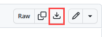

---

### Tarea 1.2 - Subir a OneDrive for Business

1. En el [Power Apps maker portal](https://make.powerapps.com) selecciona el **App launcher** en la esquina superior izquierda del navegador y luego selecciona **OneDrive**.

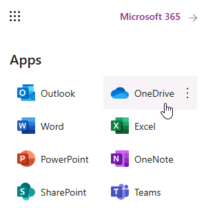

1. Si aparece una ventana emergente, selecciona **Your OneDrive is ready**.

2. Selecciona **+ Create or upload** y luego **Files upload**.

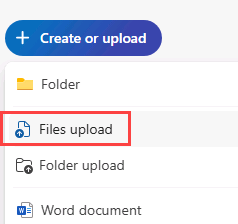

1. Navega a la carpeta **Downloads**, selecciona el archivo **CoffeeMachineData.xlsx** y luego selecciona **Open**.

2. Selecciona **My files** y verifica que CoffeeMachineData.xlsx se haya cargado correctamente.

---

## Ejercicio 2 – Crear una aplicación de lienzo a partir de datos

### Tarea 2.1 - Crear la aplicación

1. Navega al portal Power Apps Maker
   [https://make.powerapps.com](https://make.powerapps.com)

2. Asegúrate de estar en el entorno **Dev One**.

3. Selecciona la pestaña **+ Create** en el menú lateral izquierdo.

4. Selecciona el mosaico **Excel Online (Business)** en la sección **Start from data**.

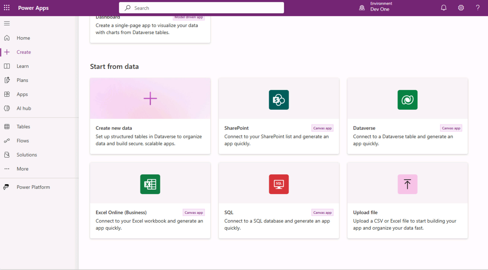

1. Se creará automáticamente una conexión de **Excel Online (Business)** después de unos segundos.

2. Expande **OneDrive for Business** en **Select the table**.

3. Expande **OneDrive**.

4. Expande el archivo Excel **CoffeeMachineData.xlsx**.

5. Selecciona la tabla **CoffeeMachines**.

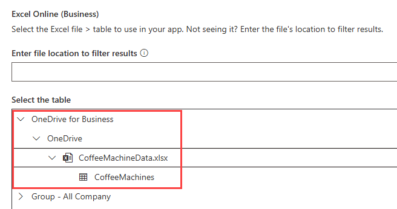

1. Selecciona **Create app**.

2. Si aparece la ventana emergente **Welcome to Power Apps Studio**, selecciona **Don't show me this again** y luego **Skip**.

3. Espera a que la aplicación sea creada.

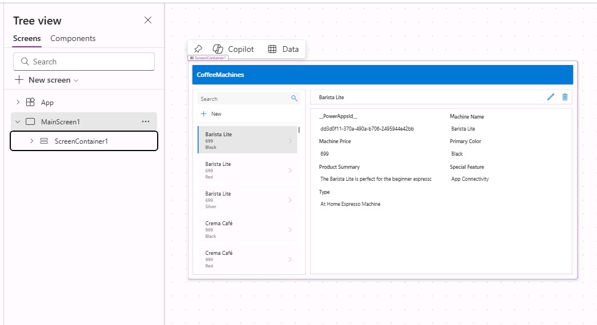

1. Selecciona **Save** en la parte superior derecha de Power Apps Studio, escribe `Coffee Machines App` en **Name** y selecciona **Save**.

---

### Tarea 2.2 - Probar la aplicación

1. Selecciona el ícono **Preview the app (F5)** en la parte superior derecha.

2. Selecciona cualquier máquina en la galería. Esto mostrará los detalles en el formulario.

3. Selecciona el ícono **Edit** en la parte superior derecha.

4. Cambia el **Machine Price** y selecciona el ícono **Tick**.

5. Selecciona el ícono **+ New** en la parte superior izquierda.

6. Ingresa `abcde` en Machine ID.

7. Ingresa `Demo Machine` en **Machine Name**.

8. Ingresa `999` en **Machine Price**.

9. Selecciona el ícono **Tick**.

10. Selecciona **X** en la esquina superior derecha para salir de la vista previa.

11. Si aparece la ventana **Did you know?**, selecciona **Don't show me this again** y luego **Ok**.

12. Selecciona el botón **<- Back** en la barra superior y luego selecciona **Leave** para salir.

---

## Ejercicio 3 – Crear una aplicación de lienzo con Copilot

### Tarea 3.1 - Crear la aplicación

1. Navega al portal Power Apps Maker
   `https://make.powerapps.com`

2. Asegúrate de estar en el entorno **Dev One**.

3. Selecciona la pestaña **Apps** en el menú lateral izquierdo.

4. Selecciona el desplegable **+New app** y luego **Start with Copilot**.

5. Selecciona el mosaico **Start with Copilot** en **Create your apps**.

6. En **Get started with Copilot**, escribe:
   `Assign coffee repairs to technicians per customer request`.

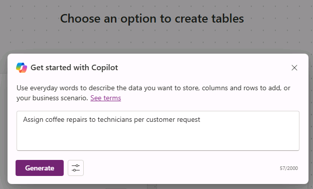

1. Selecciona el ícono **Table options** y elige **One table**.

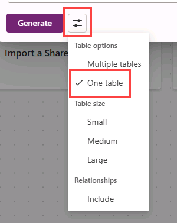

1. Selecciona **Generate**.

Copilot comenzará a generar la estructura de la tabla para la aplicación.

> **IMPORTANTE:**
> Al usar IA generativa, no siempre obtendrás exactamente los mismos resultados. Es posible que tu tabla no coincida exactamente con la de otros estudiantes.

1. Selecciona **Commands (...)** junto a la tabla y luego **View data**.

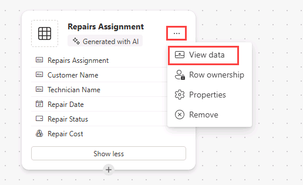

1. Revisa la tabla.

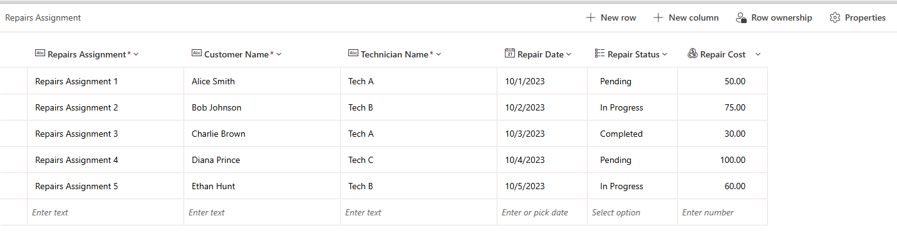

1. Cuando estés conforme con la tabla, selecciona **Save and open app**.

2. Si aparece la pantalla **Done working?**, selecciona **Don’t ask me again** y luego **Save and open app**.

3. Espera a que la aplicación se genere.

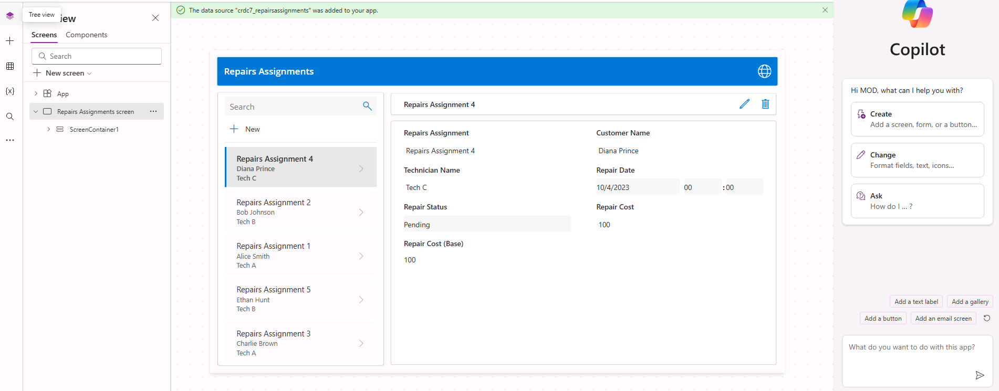

1. Selecciona **Save** en la parte superior derecha, escribe `Coffee Machine Repairs App` en **Name** y selecciona **Save**.

2. Selecciona el botón **<- Back** y luego **Leave** para salir.

3. Selecciona la pestaña **Apps** en el menú lateral izquierdo del portal Power Apps.

