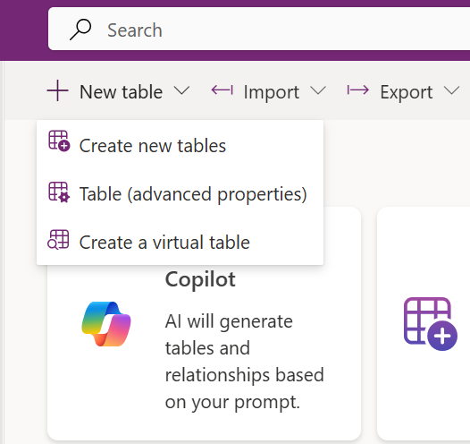
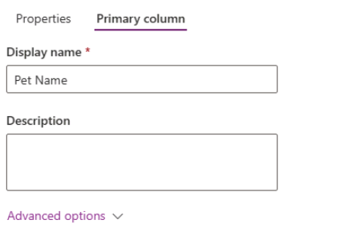
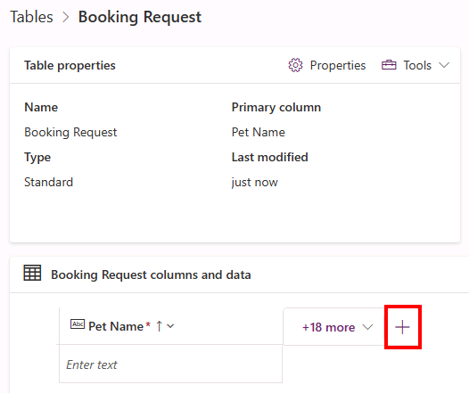
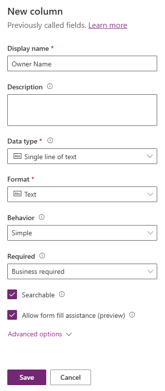
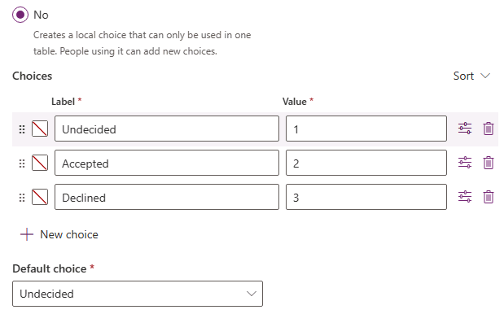
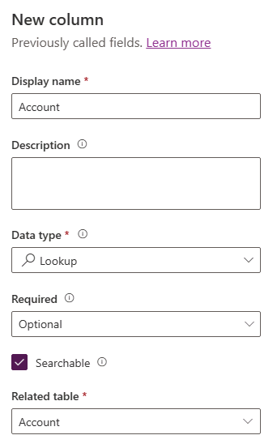

lab:
  title: 'Lab 2: Data model'
  module: 'Module 2: Get started with Microsoft Dataverse'
  description: In this lab you will create Dataverse tables and columns.
  duration: 40 minutes
  level: 100
  islab: true

# Práctica de laboratorio 2 – Modelo de datos

En este laboratorio crearás tablas y columnas en Dataverse.

## Lo que aprenderás

* Cómo crear tablas y columnas en Microsoft Dataverse
* Cómo crear una relación utilizando una columna tipo lookup

## Pasos de alto nivel del laboratorio

* Crear una tabla personalizada
* Agregar columnas a la tabla
* Crear una relación utilizando una columna lookup

## Prerrequisitos

* Debes haber completado **Lab 0: Validate lab environment**

## Pasos detallados

## Ejercicio 1 – Crear tablas personalizadas

### Tarea 1.1 - Crear la tabla Booking Request

1. Navega al portal Power Apps Maker
   `https://make.powerapps.com`

1. Asegúrate de estar en el entorno **Dev One**.

1. En el panel de navegación izquierdo, selecciona **Tables**.

1. Selecciona **+ New table** y elige **Table (advanced properties)**.

   

1. Ingresa `Booking Request` en **Display name**.

### Tarea 1.2 - Columna primaria

1. Selecciona la pestaña **primary column** junto a la pestaña **Properties**.

   

1. Ingresa `Pet Name` en **Display name**.

1. Selecciona **Save**.

### Tarea 1.3 - Agregar columnas

1. En el panel **Booking Request columns and data**, selecciona **+** para agregar una nueva columna.

   

1. En el panel **New column**, ingresa o selecciona los siguientes valores:

   * Display name: `Owner Name`
   * Data type: **Single line of text**
   * Required: **Business required**

   

1. Selecciona **Save**.

1. En el panel **Booking Request columns and data**, selecciona **+** para agregar otra columna.

1. En el panel **New column**, ingresa o selecciona:

   * Display name: `Owner Email`
   * Data type: **Single line of text**
   * Format: **Email**
   * Required: **Business required**

1. Selecciona **Save**.

1. Agrega una nueva columna con:

   * Display name: `Start Date`
   * Data type: **Date and time**
   * Format: **Date and time**
   * Required: **Business required**

1. Selecciona **Save**.

1. Agrega una nueva columna con:

   * Display name: `End Date`
   * Data type: **Date and time**
   * Format: **Date and time**
   * Required: **Optional**

1. Selecciona **Save**.

1. Agrega una nueva columna con:

   * Display name: `Cost`
   * Data type: **Currency**
   * Required: **Optional**

1. Selecciona **Save**.

1. Agrega una nueva columna con:

   * Display name: `Notes`
   * Data type: **Text** > **Multiple lines of text** > **Plain text**
   * Format: **Text**
   * Required: **Optional**

1. Selecciona **Save**.

### Tarea 1.4 - Agregar columna tipo Choice

1. En el panel **Booking Request columns and data**, selecciona **+** y en el panel **New column** ingresa:

   * Display name: `Decision`
   * Data type: **Choice** > **Choice**
   * Required: **Optional**

1. Selecciona **No** en **Sync with global choice?**

1. Ingresa `Undecided` en **Label** y `1` en **Value**.

1. Selecciona **+ New choice** y agrega:

   * Label: `Accepted`
   * Value: `2`

1. Selecciona **+ New choice** y agrega:

   * Label: `Declined`
   * Value: `3`

1. Selecciona **Undecided** como **Default choice**.

   

1. Selecciona **Save**.

## Ejercicio 2 – Crear relación

### Tarea 2.1 - Crear una columna lookup

1. Navega al portal Power Apps Maker
   `https://make.powerapps.com`

1. Asegúrate de estar en el entorno **Dev One**.

1. En el panel izquierdo, selecciona **Tables**.

1. Selecciona **Booking Request**.

1. En el panel **Booking Request columns and data**, selecciona **+** y configura:

   * Display name: `Account`
   * Data type: **Lookup** > **Lookup**
   * Required: **Optional**
   * Related table: **Account**

   

1. Selecciona **Save**.

## Ejercicio 3 – Datos

### Tarea 3.1 - Agregar registros de Booking Request

1. Navega al portal Power Apps Maker
   [https://make.powerapps.com](https://make.powerapps.com)

1. Asegúrate de estar en el entorno **Dev One**.

1. En el panel izquierdo, selecciona **Tables**.

1. Selecciona **Booking Request**.

1. En el panel **Booking Request columns and data**, selecciona la flecha desplegable junto a **Edit** y luego **Edit in new tab**.

1. Ingresa o selecciona los siguientes valores:

   * Pet Name: `Fido`
   * Owner Name: `MOD Administrator`
   * Owner Email: Usa el correo de tu tenant
   * Start Date: **Tomorrow**
   * End Date: **Selecciona una fecha en la siguiente semana**
   * Cost: `1,000`
   * Decision: **Accepted**

1. Selecciona **Insert row below** e ingresa:

   * Pet Name: `Tom`
   * Owner Name: `MOD Administrator`
   * Owner Email: Usa el correo de tu tenant
   * Start Date: **Selecciona una fecha en el siguiente mes**
   * End Date: **Selecciona una fecha posterior al inicio**
   * Cost: `1,500`
   * Decision: **Undecided**

1. Selecciona **Insert row below** e ingresa:

   * Pet Name: `Jim`
   * Owner Name: `MOD Administrator`
   * Owner Email: Usa el correo de tu tenant
   * Start Date: **Selecciona una fecha futura en el mes actual**
   * End Date: **Selecciona una fecha posterior al inicio**
   * Cost: `250`
   * Decision: **Declined**

1. Cierra la pestaña de edición de datos.

