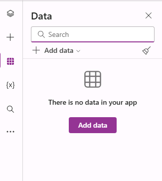
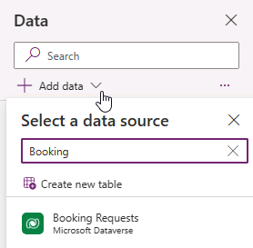
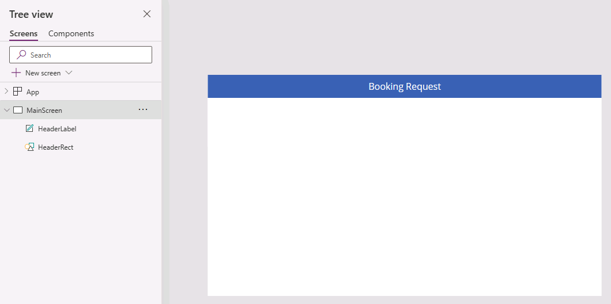
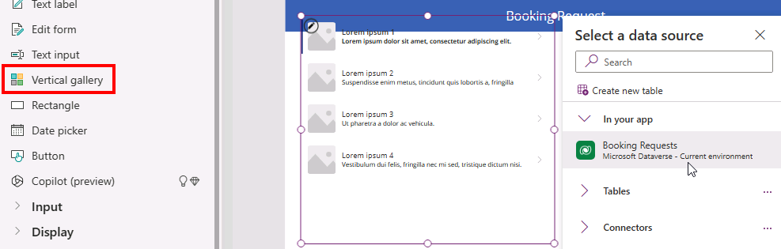
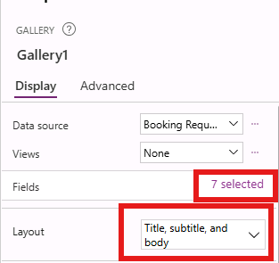
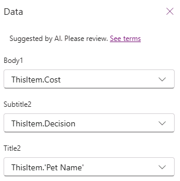
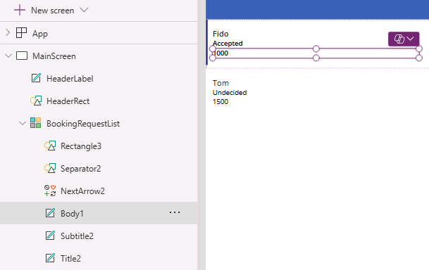

---
lab:
  title: 'Lab 3: Create a canvas app'
  module: 'Module 3: Customize a canvas app in Power Apps'
  description: In this lab you will design and build a canvas app from blank, add a data source and a gallery.
  duration: 45 minutes
  level: 100
  islab: true
---

# Practice Lab 3 – Crear una canvas app

En este laboratorio diseñarás y construirás una canvas app desde cero, agregarás una fuente de datos y una gallery.

## What you will learn

* Cómo crear una canvas app con una gallery vinculada a una fuente de datos
* Cómo dar formato a campos usando fórmulas de Power Fx

## High-level lab steps

* Crear una canvas app desde cero
* Agregar una fuente de datos a la app
* Agregar una gallery a la app
* Configurar los campos en la gallery

## Prerequisites

* Debes haber completado **Lab 2: Data model**

## Detailed steps

## Exercise 1 – Crear una canvas app

### Task 1.1 - Crear la app

1. Navega al Power Apps Maker portal `https://make.powerapps.com`

1. Asegúrate de estar en el entorno **Dev One**

1. Selecciona la pestaña **+ Create** del menú de navegación izquierdo

1. Selecciona el mosaico **Create from blank** en **Start from design**

1. Selecciona **Tablet size**

1. Espera a que la app en blanco se cree

1. Selecciona **Save** en la parte superior derecha de Power Apps Studio, ingresa `Booking Request app` en **Name** y selecciona **Save**

---

### Task 1.2 - Agregar data source

1. En el menú de autoría de la app, selecciona **Data**

   

1. Selecciona la flecha desplegable junto a **Add data** e ingresa `Booking` en **Search**

   

1. Selecciona la tabla **Booking Requests** de Microsoft Dataverse

---

### Task 1.3 - Configurar la pantalla principal

1. En el menú de autoría, selecciona **Tree view**

1. Selecciona **Screen1**, luego el menú (**...**) y selecciona **Rename**

1. Ingresa `MainScreen`

1. En el menú de autoría, selecciona **Insert (+)**

1. Expande la categoría **Shapes** y selecciona **Rectangle**

1. Arrastra el rectángulo a la parte superior izquierda de la pantalla

1. En el menú de autoría, selecciona **Tree view**

1. Renombra el rectángulo a `HeaderRect`

1. Configura las propiedades del rectángulo en la barra de fórmulas:

   1. X=`0`
   1. Y=`0`
   1. Height=`80`
   1. Width=`Parent.Width`

1. En el menú de autoría, selecciona **Insert (+)**

1. Selecciona **Text label**

1. Arrastra la etiqueta a la parte superior izquierda

1. En el menú de autoría, selecciona **Tree view**

1. Renombra la etiqueta a `HeaderLabel`

1. Configura las propiedades en la barra de fórmulas:

    1. X=`0`
    1. Y=`0`
    1. Height=`80`
    1. Width=`Parent.Width`
    1. Align=`Align.Center`
    1. Size=`24`
    1. Text=`"Booking Request"`
    1. Color=`Color.White`

    

1. Selecciona **Save** en la parte superior derecha de Power Apps Studio

---

### Task 1.4 - Agregar una gallery

1. En el menú de autoría, selecciona **Insert (+)**

1. Selecciona **Vertical gallery**

   

1. Selecciona **Booking Requests** como fuente de datos

   

1. En la pestaña **Properties**, en **Layout** selecciona **Title, subtitle, and body**

1. Selecciona **7 selected** junto a **Fields**

1. Selecciona **Cost** para **Body1**

   > **NOTE:** Los nombres de los campos pueden mostrarse como nombres de esquema con prefijo en lugar del nombre visible

1. Selecciona **Decision** para **Subtitle2**

1. Selecciona **Pet Name** para **Title2**

   

1. Cierra el panel **Data**

1. En el menú de autoría, selecciona **Tree view**

1. Renombra la gallery a `BookingRequestList`

1. Si aparece una ventana de sugerencias, selecciona **Cancel**

1. Configura las propiedades de la gallery en la barra de fórmulas:

    1. X=`0`
    1. Y=`80`
    1. Height=`575`
    1. Width=`250`

---

### Task 1.5 - Dar formato al campo de moneda

1. En el menú de autoría, selecciona **Tree view**

1. Expande la gallery **BookingRequestList**

1. Selecciona **Body1**

   

1. Configura la propiedad **Text** en la barra de fórmulas con:

```powerappsfl
Text(Value(ThisItem.Cost), "$#,##0.00")
```

1. Selecciona **Save** en la parte superior derecha de Power Apps Studio

1. Selecciona el botón **<- Back** y luego **Leave** para salir de la app

