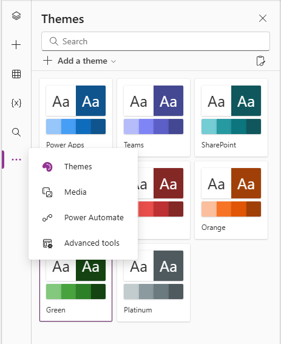
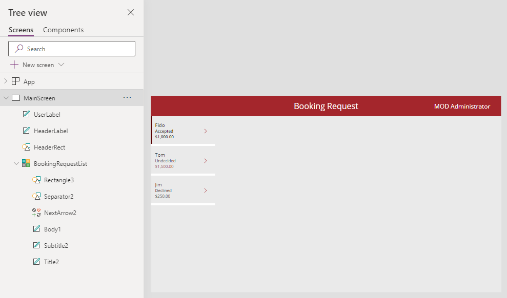

---
lab:
  title: 'Lab 4: Build the UI'
  module: 'Module 4: How to build the UI in a canvas app in Power Apps'
  description: In this lab you will change the colors of the controls in the app.
  duration: 10 minutes
  level: 100
  islab: true
---

# Practice Lab 4 – Construir la UI

En este laboratorio cambiarás los colores de los controles en la app.

## What you will learn

* Cómo usar themes
* Cómo personalizar tu app

## High-level lab steps

* Seleccionar un theme
* Personalización

## Prerequisites

* Debes haber completado **Lab 3: Create a canvas app**

## Detailed steps

## Exercise 1 – Theme

### Task 1.1 - Editar la app

1. Navega al Power Apps Maker portal [https://make.powerapps.com](https://make.powerapps.com)

2. Asegúrate de estar en el entorno **Dev One**

3. Selecciona la pestaña **Apps** en el menú lateral izquierdo

4. Selecciona la **Booking Request app**, luego selecciona Commands (**...**) y elige **Edit > Edit in new tab**

---

### Task 1.2 - Seleccionar un theme

1. En la action bar de Power Apps Studio, selecciona Commands (**...**) y luego **Theme**

   

2. Selecciona el theme **Red**

---

### Task 1.3 - Aplicar branding a controles

1. En el menú de autoría de la app, selecciona **Tree view**

2. Expande la gallery **BookingRequestList**

3. Selecciona **NextArrow2**

4. Configura la propiedad **Color** de NextArrow en la barra de fórmulas:

```powerappsfl
RGBA(164, 38, 44, 1)
```

1. Selecciona **Body1**

2. Configura la propiedad **Color** de Body en la barra de fórmulas:

```powerappsfl
If(ThisItem.Cost > 1000, RGBA(164, 38, 44, 1), Color.Black)
```

1. Selecciona **Save** en la parte superior derecha de Power Apps Studio

---

## Exercise 2 – Personalización

### Task 2.1 - Agregar etiqueta de usuario

1. Selecciona fuera de la gallery en el canvas en blanco o selecciona **MainScreen**

2. En el menú de autoría, selecciona **Insert (+)**

3. Selecciona **Text label**

4. Arrastra la etiqueta a la parte superior derecha de la pantalla

5. En el menú de autoría, selecciona **Tree view**

6. Renombra la etiqueta a `UserLabel`

7. Configura las propiedades en la barra de fórmulas:

   1. X=`1100`
   2. Y=`20`
   3. Height=`40`
   4. Width=`250`
   5. Align=`Align.Right`
   6. Size=`18`
   7. PaddingRight=`10`
   8. Color=`Color.White`
   9. Text=`User().FullName`

   

8. Selecciona **Save** en la parte superior derecha de Power Apps Studio

9. Selecciona el botón **<- Back** y luego **Leave** para salir de la app
