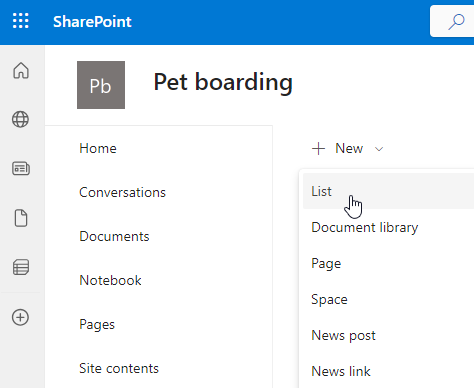
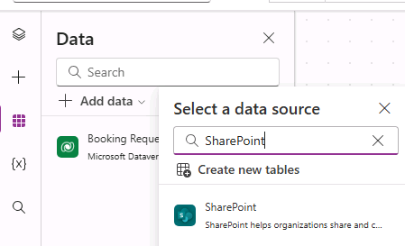
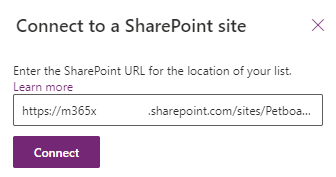
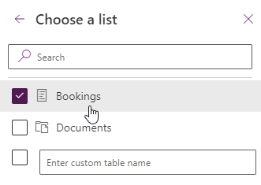
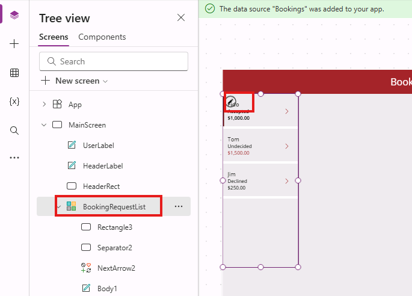
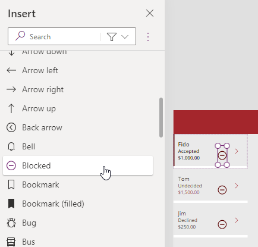
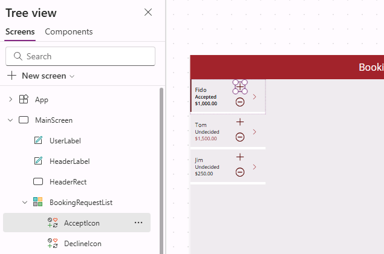

---
lab:
  title: 'Lab 5: External data'
  module: 'Module 5: Work with external data in a Power Apps canvas app'
  description: In this lab you will add an external data source.
  duration: 30 minutes
  level: 100
  islab: true
---

# Practice Lab 5 – Datos externos

En este laboratorio agregarás una fuente de datos externa.

## What you will learn

* Cómo agregar una lista de SharePoint a tu canvas app
* Cómo usar collections
* Cómo usar Patch
* Cómo usar el conector Office365Users

## High-level lab steps

* Crear una lista de SharePoint para Bookings
* Agregar la lista de SharePoint como una gallery
* Almacenar registros seleccionados de una gallery
* Usar Patch para establecer la decisión de una solicitud
* Usar el conector Office365Users para mostrar los detalles del usuario

## Prerequisites

* Debes haber completado **Lab 4: Build the UI**

## Detailed steps

## Exercise 1 – Crear lista de SharePoint

### Task 1.1 Crear un sitio de SharePoint

1. En el Power Apps maker portal `https://make.powerapps.com`, selecciona el **App launcher** en la esquina superior izquierda y luego selecciona **SharePoint**

2. Si aparece la ventana **Welcome to SharePoint Start Page**, selecciona **✖** para cerrarla

3. En SharePoint, selecciona **+ Create site**

4. Selecciona **Team site**, selecciona la plantilla **Standard team** y luego selecciona **Use template**

5. Ingresa `Pet boarding` en **Site name** y selecciona **Next**

6. Selecciona **Create site**

7. Selecciona **Finish**

8. Si aparece la ventana **Start designing your site**, ciérrala

---

### Task 1.2 Crear una lista de SharePoint

1. En el sitio de SharePoint, selecciona **+ New** y luego **List**

   

2. Selecciona **List** en **Create from blank**

3. Ingresa `Bookings` en **Name** y selecciona **Create**

4. Selecciona **+ Add column**, selecciona **Text** y luego **Next**

5. En el panel **Create a column**, ingresa:

   1. Name: `Pet Name`
   2. Data type: **Single line of text**

6. Selecciona **Save**

7. Selecciona **+ Add column**, selecciona **Text** y luego **Next**

8. En el panel **Create a column**, ingresa:

   1. Name: `Owner Name`
   2. Data type: **Single line of text**

9. Selecciona **Save**

10. Selecciona **+ Add column**, selecciona **Date and time** y luego **Next**

11. En el panel **Create a column**, ingresa:

    1. Name: `Start Date`
    2. Data type: **Date and time**

12. Selecciona **Save**

13. Selecciona **+ Add column**, selecciona **Date and time** y luego **Next**

14. En el panel **Create a column**, ingresa:

    1. Name: `End Date`
    2. Data type: **Date and time**

15. Selecciona **Save**

16. Copia la primera parte de la URL del sitio de SharePoint, por ejemplo
    `https://m365x99999999.sharepoint.com/sites/Petboarding/`

---

## Exercise 2 – Agregar lista de SharePoint a canvas app

### Task 2.1 - Editar la app

1. Navega al Power Apps Maker portal `https://make.powerapps.com`

2. Asegúrate de estar en el entorno **Dev One**

3. Selecciona la pestaña **Apps** en el menú izquierdo

4. Selecciona **Booking Request app**, luego Commands (**...**) y selecciona **Edit > Edit in new tab**

---

### Task 2.2 - Agregar SharePoint como data source

1. En el menú de autoría, selecciona **Data**

2. Selecciona la flecha junto a **Add data** e ingresa `SharePoint` en **Search**

   

3. Selecciona **SharePoint**

4. Selecciona **Connect directly (cloud services)** y luego **Connect**

5. Ingresa la URL del sitio de SharePoint creado previamente

   

6. Selecciona **Connect**

7. Selecciona **Bookings**

   

8. Selecciona **Connect**

---

### Task 2.3 - Agregar gallery para lista de SharePoint

1. En el menú de autoría, selecciona **Insert (+)**

2. Selecciona **Vertical gallery**

3. Selecciona **Bookings** como data source

4. Selecciona **Title and subtitle** en **Layout**

5. Selecciona **6 selected** junto a **Fields**

6. Selecciona **Pet Name** para **Title3**

7. Selecciona **Start Date** para **Subtitle3**

8. Cierra el panel **Data**

9. En el menú de autoría, selecciona **Tree view**

10. Renombra la gallery a `BookingList`

11. Configura las propiedades en la barra de fórmulas:

    1. X=`1000`
    2. Y=`80`
    3. Height=`575`
    4. Width=`250`

---

## Exercise 3 – Collections

### Task 3.1 Crear Collection

1. En el menú de autoría, selecciona **Tree view**

2. Expande **BookingRequestList**

3. Selecciona **NextArrow2**

4. Configura la propiedad **OnSelect**:

```powerappsfl
Collect(colRequests, ThisItem)
```

1. En el menú de autoría, selecciona **Tree view**

2. Selecciona el objeto **App**

3. Configura la propiedad **OnStart**:

```powerappsfl
Clear(colRequests)
```

---

## Exercise 4 – Patch

### Task 4.1 Rechazar solicitud

1. En el menú de autoría, selecciona **Tree view**

2. Selecciona **BookingRequestList**

3. Selecciona el ícono **pencil** en la parte superior izquierda

   

4. En el menú de autoría, selecciona **Insert (+)**

5. Expande **Classic icons**

6. Selecciona **Blocked**

7. Configura propiedades:

   1. X=`150`
   2. Y=`60`
   3. Height=`30`
   4. Width=`30`

   

8. Selecciona **Tree view** 

9. renombra a `DeclineIcon`

10. Configura **OnSelect**:

```powerappsfl
Patch('Booking Requests', ThisItem, {Decision: 'Decision (Booking Requests)'.Declined})
```

---

### Task 4.2 Confirmar solicitud

1. En **Tree view**, selecciona **BookingRequestList**

2. Selecciona el ícono **pencil**

3. En **Insert (+)** selecciona **Add** en **Classic icons**

4. Configura propiedades:

   1. X=`150`
   2. Y=`10`
   3. Height=`30`
   4. Width=`30`

5. Renombra a `AcceptIcon`

   

6. Configura **OnSelect**:

```powerappsfl
Patch(Bookings,Defaults(Bookings),{Title:"New Booking",'Pet Name':ThisItem.'Pet Name','Owner Name':ThisItem.'Owner Name', 'Start Date':ThisItem.'Start Date','End Date':ThisItem.'End Date'})
```

---

## Exercise 5 – Office 365 Users

### Task 5.1 Agregar Office 365 Users como data source

1. En el menú de autoría, selecciona **Data**

2. En **Add data**, busca `Office 365`

3. Selecciona **Office 365 Users**

4. Selecciona **Connect**

---

### Task 5.2 Mostrar el país del usuario

1. Selecciona fuera de la gallery o **MainScreen**

2. En **Insert (+)** selecciona **Text label**

3. Coloca la etiqueta en la parte superior derecha junto a UserLabel

4. En **Tree view**, renombra a `UserDetailsLabel`

5. Configura **Text**:

```powerappsfl
Office365Users.MyProfile().Country
```

> **Note:** Si no se muestra el país, ve a `https://admin.microsoft.com`, selecciona **Users > Active users**, abre el perfil, selecciona **Manage contact information** y configura **Country or region**

1. Configura propiedades:

   1. X=`930`
   2. Y=`20`
   3. Size=`18`
   4. Color=`Color.White`

2. Selecciona **Save**

3. Selecciona **<- Back** y luego **Leave**
