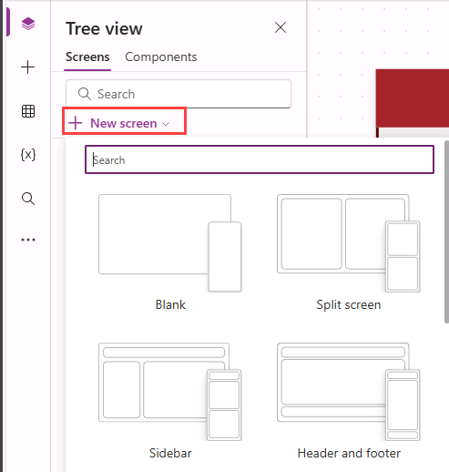
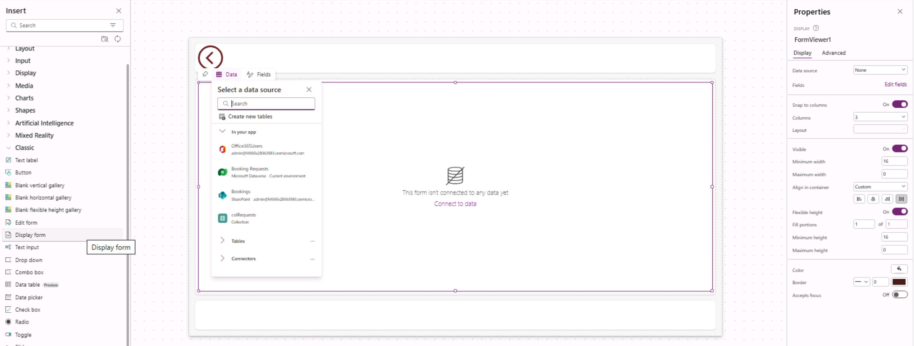
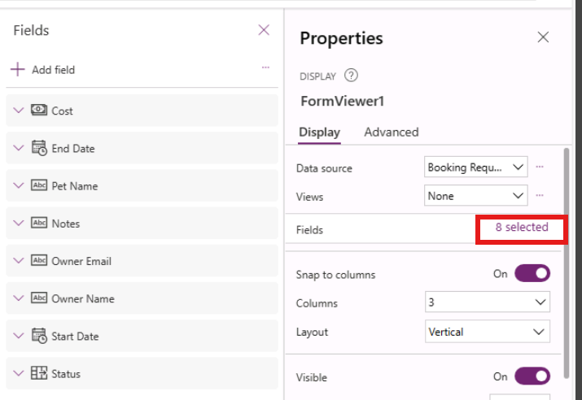
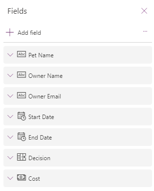
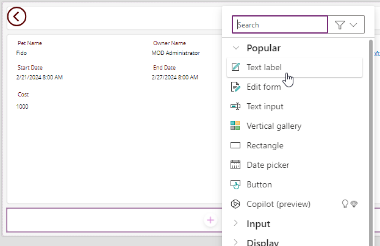
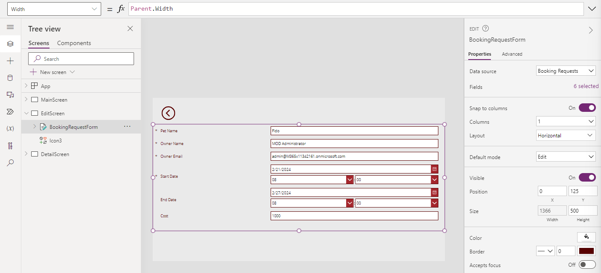

---
lab:
  title: 'Lab 6: Forms'
  module: 'Module 6: Write data in a Power Apps canvas app'
  description: In this lab you will use forms to create and edit records in a data source.
  duration: 45 minutes
  level: 100
  islab: true
---

# Practice Lab 6 – Forms

En este laboratorio usarás forms para crear y editar registros en una fuente de datos.

## What you will learn

* Cómo agregar screens
* Cómo navegar entre screens
* Cómo usar un form para crear un registro en una fuente de datos
* Cómo usar un form para editar un registro en una fuente de datos
* Cómo eliminar un registro de una fuente de datos
* Cómo vincular un form a una gallery

## High-level lab steps

* Crear nuevas screens
* Navegar a una screen cuando se selecciona un registro en una gallery
* Navegar entre screens
* Mostrar un registro con un form
* Eliminar un registro
* Editar un registro con un form
* Crear un nuevo registro con un form

## Prerequisites

* Debes haber completado **Lab 5: External data**

## Detailed steps

## Exercise 1 – Agregar screens y navegación

### Task 1.1 - Editar la app

1. Navega al Power Apps Maker portal `https://make.powerapps.com`

2. Asegúrate de estar en el entorno **Dev One**

3. Selecciona la pestaña **Apps** en el menú de navegación izquierdo

4. Selecciona la **Booking Request app**, selecciona Commands (**...**) y luego **Edit > Edit in new tab**

---

### Task 1.2 - Agregar screens

1. En el menú de autoría de la app, selecciona **Tree view**

2. En la parte superior de Tree view, selecciona **+ New screen**

   

3. Selecciona **Blank**

4. Renombra la screen a `EditScreen`

5. En la parte superior de Tree view, selecciona **+ New screen**

6. Selecciona **Header and footer**

7. Renombra la screen a `DetailScreen`

---

### Task 1.3 - Agregar navegación

1. En el **Tree view**, expande **BookingRequestList** en **MainScreen**

2. Selecciona **NextArrow2** en **BookingRequestList**

3. Configura la propiedad **OnSelect** de NextArrow:

```powerappsfl
Collect(colRequests, ThisItem);Navigate(DetailScreen, ScreenTransition.Cover);
```

4. Selecciona **EditScreen**

5. En el menú de autoría, selecciona **Insert (+)**

6. Expande **Classic icons**

7. Selecciona **Back arrow**

8. Configura la propiedad **OnSelect**:

```powerappsfl
Back()
```

9. Renombra el icono a `BackIconEdit`

10. En el **Tree view**, selecciona el icono, luego Commands (**...**) y selecciona **Copy**

11. Expande **DetailScreen**

12. Expande **ScreenContainer1**

13. Selecciona **HeaderContainer1**, luego Commands (**...**) y selecciona **Paste**

14. Renombra el icono a `BackIconDetail`

---

## Exercise 2 – Pantalla de detalles

### Task 2.1 - Agregar display form

1. En el menú de autoría, selecciona **Tree view**

2. Expande **DetailScreen**

3. Expande **ScreenContainer1**

4. Selecciona **MainContainer1**

5. En el menú de autoría, selecciona **Insert (+)**

6. Expande **Classic**

7. Selecciona **Display form**

   

8. En las propiedades del FormViewer, selecciona **Booking Requests** como **Data source**

9. Selecciona **8 selected** junto a **Fields**

   

10. Agrega o elimina campos para que queden en este orden:

    1. Pet Name
    2. Owner Name
    3. Owner Email
    4. Start Date
    5. End Date
    6. Decision
    7. Cost

    

11. **Close** el panel **Fields**

12. Configura la propiedad **Item** del form:

```powerappsfl
BookingRequestList.Selected
```

---

### Task 2.2 - Agregar label

1. En el menú de autoría, selecciona **Tree view**

2. Expande **DetailScreen**

3. Expande **ScreenContainer1**

4. Selecciona **FooterContainer1**

5. Selecciona **+** dentro del contenedor

   

6. Selecciona **Text label**

7. Configura la propiedad **Text**:

```powerappsfl
BookingRequestList.Selected.'Pet Name'
```

---

### Task 2.3 - Agregar botón de eliminación

1. En el menú de autoría, selecciona **Tree view**

2. Expande **DetailScreen**

3. Expande **ScreenContainer1**

4. Selecciona **FooterContainer1**

5. En el menú de autoría, selecciona **Insert (+)**

6. Selecciona **Button**

7. En el menú de autoría, selecciona **Tree view**

8. Renombra el botón a `Deletebtn`

9. Configura la propiedad **Text**:

```powerappsfl
"Delete"
```

1. Configura la propiedad **OnSelect**:

```powerappsfl
Remove('Booking Requests', BookingRequestList.Selected); Back();
```

---

## Exercise 3 – Pantalla de edición

### Task 3.1 - Agregar Edit form

1. En el menú de autoría, selecciona **Tree view**

2. Selecciona **EditScreen**

3. En el menú de autoría, selecciona **Insert (+)**

4. Selecciona **Edit form**

5. En las propiedades del Form, selecciona **Booking Requests** como **Data source**

6. Selecciona **9 selected** junto a **Fields**

7. Agrega o elimina campos en el siguiente orden:

   1. Pet Name
   2. Owner Name
   3. Owner Email
   4. Start Date
   5. End Date
   6. Cost

8. **Close** el panel **Fields**

9. Configura la propiedad **Item**:

```powerappsfl
BookingRequestList.Selected
```

1. En el menú de autoría, selecciona **Tree view**

2. Renombra el form a `BookingRequestForm`

3. Configura las propiedades:

   1. X=`0`
   2. Y=`125`
   3. Height=`500`
   4. Width=`Parent.Width`
   5. Columns=`1`
   6. Layout=`Horizontal`

   

---

### Task 3.2 - Agregar botón Submit

1. En el menú de autoría, selecciona **Tree view**

2. Selecciona **EditScreen**

3. En el menú de autoría, selecciona **Insert (+)**

4. Selecciona **Button**

5. Arrastra el botón debajo del form

6. En el menú de autoría, selecciona **Tree view**

7. Renombra el botón a `Submitbtn`

8. Configura la propiedad **Text**:

```powerappsfl
"Submit"
```

9. Configura la propiedad **OnSelect**:

```powerappsfl
SubmitForm(BookingRequestForm)
```

10. Selecciona **BookingRequestForm**

11. Configura la propiedad **OnSuccess**:

```powerappsfl
Navigate(MainScreen, ScreenTransition.UnCover)
```

---

### Task 3.3 - Agregar navegación a pantalla de edición

1. En el menú de autoría, selecciona **Tree view**

2. Expande **DetailScreen**

3. Expande **ScreenContainer1**

4. Selecciona **HeaderContainer1**

5. En el menú de autoría, selecciona **Insert (+)**

6. Expande **Classic icons**

7. Selecciona **Edit**

8. En el menú de autoría, selecciona **Tree view**

9. Renombra el icono a `EditIcon`

10. Configura la propiedad **OnSelect**:

```powerappsfl
Navigate(EditScreen, ScreenTransition.Cover)
```

---

### Task 3.4 - Nuevo registro

1. En el menú de autoría, selecciona **Tree view**

2. Selecciona **MainScreen**

3. En el menú de autoría, selecciona **Insert (+)**

4. Expande **Classic icons**

5. Selecciona **Add**

6. En el menú de autoría, selecciona **Tree view**

7. Renombra el icono a `NewIcon`

8. Configura las propiedades:

   1. X=`0`
   2. Y=`0`
   3. Height=`80`
   4. Width=`80`
   5. Color=`Color.White`

9. Configura la propiedad **OnSelect**:

```powerappsfl
NewForm(BookingRequestForm);Navigate(EditScreen, ScreenTransition.Cover)
```

1. Selecciona **Save** en la parte superior derecha de Power Apps Studio

2. Selecciona **<- Back** y luego **Leave** para salir

