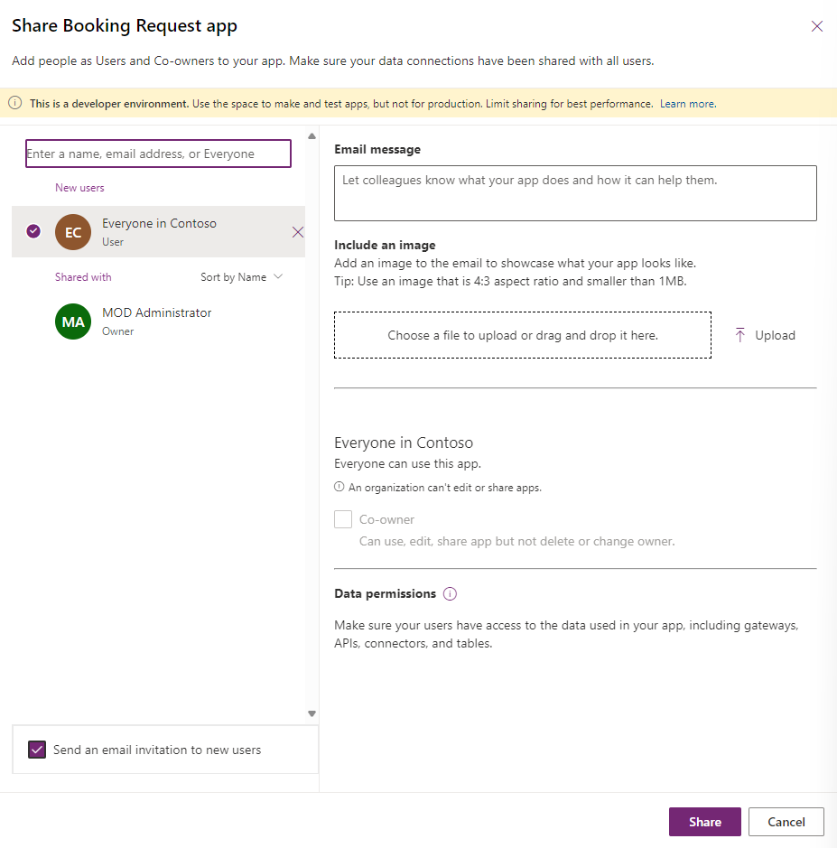
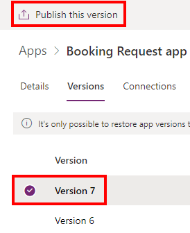
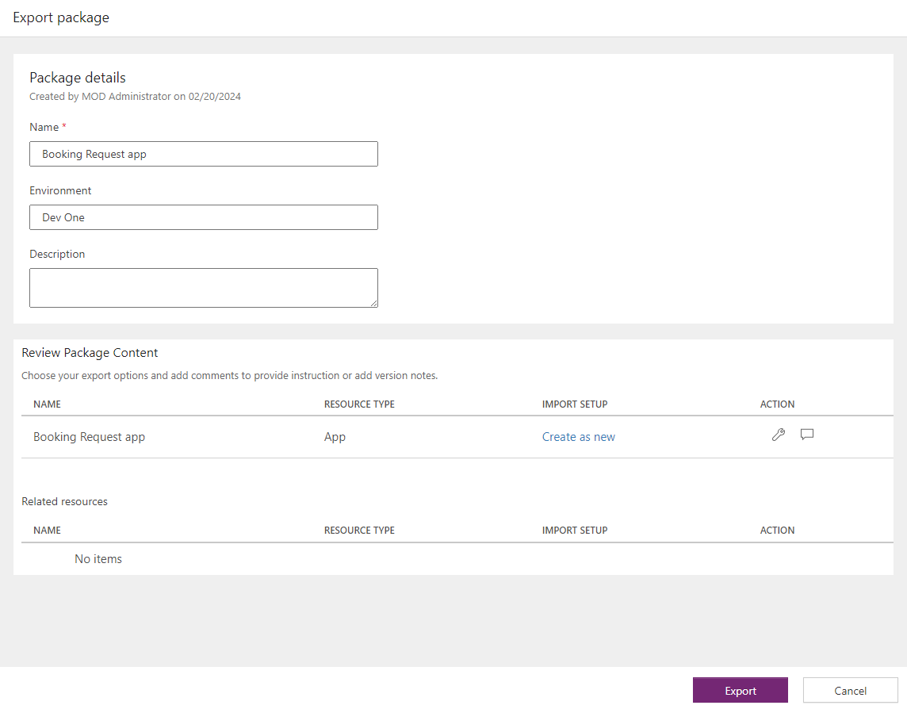

---
lab:
  title: 'Lab 7: Manage canvas apps'
  module: 'Module 7: Publish, share, and maintain a canvas app'
  description: In this lab you will manage your canvas app.
  duration: 10 minutes
  level: 100
  islab: true
---

# Practice Lab 7 – Administrar canvas apps

En este laboratorio administrarás tu canvas app.

## What you will learn

* Cómo compartir canvas apps
* Cómo administrar versiones de canvas apps
* Cómo publicar canvas apps
* Cómo exportar canvas apps

## High-level lab steps

* Compartir una canvas app
* Ver versiones de una canvas app
* Publicar una canvas app
* Exportar una canvas app

## Prerequisites

* Debes haber completado **Lab 6: Forms**

## Detailed steps

## Exercise 1 – Administrar

### Task 1.1 - Compartir la Booking Request app

1. Navega al Power Apps Maker portal `https://make.powerapps.com`

2. Asegúrate de estar en el entorno **Dev One**

3. Selecciona la pestaña **Apps** en el menú de navegación izquierdo

4. Selecciona la **Booking Request app**, luego Commands (**...**) y selecciona **Share**

   

5. En el panel Share, ingresa `Everyone` y selecciona **Everyone in Contoso**

   

6. Selecciona **Share**

7. **Close** el panel Share

---

### Task 1.2 - Publicar la Booking Request app

1. Selecciona la **Booking Request app**, luego Commands (**...**) y selecciona **Details**

2. Selecciona la pestaña **Versions**

   

3. Selecciona la versión más alta

   

4. Selecciona **Publish this version**

5. Selecciona nuevamente **Publish this version**

---

## Exercise 2 – Exportar

### Task 2.1 - Exportar la Booking Request app

1. Navega al Power Apps Maker portal `https://make.powerapps.com`

2. Asegúrate de estar en el entorno **Dev One**

3. Selecciona la pestaña **Apps** en el menú de navegación izquierdo

4. Selecciona la **Booking Request app**, luego Commands (**...**) y selecciona **Export package**

5. Ingresa `Booking Request app` en **Name**

6. Selecciona **Update** en **Import setup**

7. Selecciona **Create as new** y luego **Save**

   

8. Selecciona **Export**

9. Espera a que el paquete sea creado y descargado. Esto genera un archivo zip en tu carpeta **Downloads**

---

### Task 2.2 - Guardar la app localmente

1. Selecciona la pestaña **Apps** en el menú de navegación izquierdo

2. Selecciona la **Booking Request app**, luego Commands (**...**) y selecciona **Edit > Edit in new tab**

3. Selecciona la flecha desplegable junto a **Save** en la parte superior derecha de Power Apps Studio

4. Selecciona **Download a copy**

5. Selecciona **Download**. Esto genera un archivo `.msapp` en tu carpeta **Downloads**

6. Selecciona **Save**

7. Selecciona el botón **<- Back** y luego **Leave** para salir

